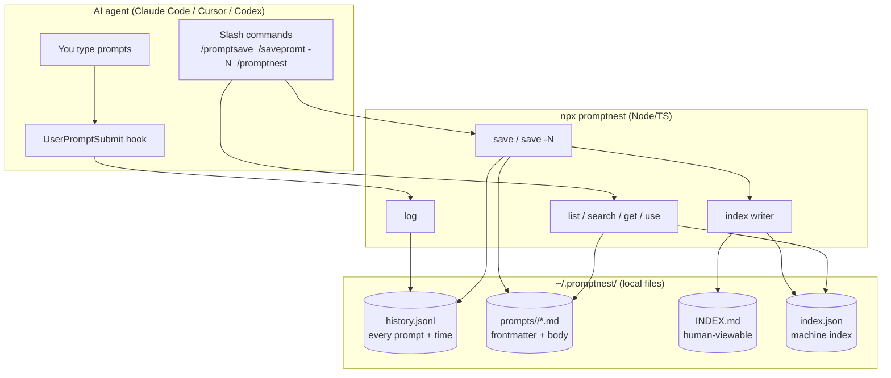
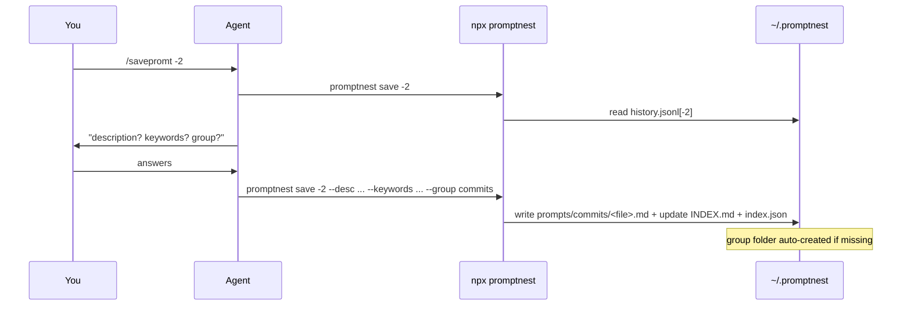

# PromptNest — Architecture & Design (Local File-Based Skill)

> **Status:** design report (no code changed).
> **Prev:** [`00_Agent_CLI_Overview.md`](00_Agent_CLI_Overview.md) · **Next:** [`02_Implementation_Plan.md`](02_Implementation_Plan.md)

---

## 1. Component architecture

Everything is local. Three moving parts: a **watcher hook**, an **npx CLI**, and a **local file store** (files + index). No server, no database, no network.



## 2. The two flows

### 2a. Watch (automatic, every prompt)
```mermaid
sequenceDiagram
    participant U as You
    participant H as UserPromptSubmit hook
    participant C as npx promptnest log
    participant F as history.jsonl
    U->>H: sends a prompt
    H->>C: pipes { prompt, timestamp } on stdin
    C->>F: append one line
    Note over F: file is the running "counter"; line N from end = the -N prompt
```

### 2b. Capture & reuse (on command)


## 3. On-disk layout

```
~/.promptnest/
├── config.json                 # settings (editor, default group, etc.)
├── history.jsonl               # WATCHER LOG — one JSON line per prompt sent
├── index.json                  # MACHINE INDEX — fast list/count/search
├── INDEX.md                    # HUMAN INDEX — auto-generated, clickable
└── prompts/
    ├── code-review/            # group == folder (auto-created)
    │   └── 2026-07-12_lang-review.md
    └── commits/
        └── 2026-07-12_conventional.md
```

### `history.jsonl` (the watcher log / counter)
```json
{"ts":"2026-07-12T14:29:40","text":"review this file for security issues"}
{"ts":"2026-07-12T14:31:02","text":"now write a conventional commit for it"}
```
- **Count** = number of lines. `/savepromt -1` = last line, `-2` = second-to-last.
- Rolling log; optional cap (e.g. keep last 500 lines) to bound size.

### A saved prompt file (frontmatter + body)
```markdown
---
id: 2026-07-12_lang-review
title: Lang-aware code review
description: Reviews a file for a given language and focus area
keywords: [review, security, python]
group: code-review
source: "history:-2"          # where it was captured from
created: 2026-07-12T14:32:10
uses: 0
---

Review the following {{language}} code, focusing on {{focus}}.
List issues by severity with a concrete fix for each.
```

### `index.json` (machine index)
```json
{
  "prompts": [
    { "id": "2026-07-12_lang-review", "title": "Lang-aware code review",
      "group": "code-review", "keywords": ["review","security","python"],
      "file": "prompts/code-review/2026-07-12_lang-review.md",
      "created": "2026-07-12T14:32:10", "uses": 0 }
  ],
  "groups": ["code-review", "commits"],
  "count": 1
}
```

### `INDEX.md` (human index — auto-generated, like a memory index)
```markdown
# PromptNest Index  (1 prompt · 2 groups)

## code-review
- [Lang-aware code review](prompts/code-review/2026-07-12_lang-review.md) — review, security · used 0×
```

## 4. Command surface (`npx promptnest`, alias `pn`)

| Command | Purpose |
|---|---|
| `pn log` | (called by the hook) append the piped prompt to `history.jsonl` |
| `pn save [-N] [--desc ..] [--keywords a,b] [--group g]` | promote `history[-N]` (default `-1`) into a saved `.md`; auto-create group; update indexes |
| `pn save --text "..."` | save an explicit string (for agents without a hook) |
| `pn list [--group g] [--keyword k]` | list saved prompts (reads `index.json`) |
| `pn search "<q>"` | search titles/keywords/body |
| `pn get <id>` | print one saved prompt |
| `pn use <id> [--var k=v ...]` | fetch + fill `{{vars}}`, bump `uses` |
| `pn count` | how many prompts are in `history.jsonl` (valid `-N` range) and how many saved |
| `pn open` | print the vault path / open `~/.promptnest/` in the editor |
| `pn rebuild-index` | regenerate `INDEX.md` + `index.json` from the files |
| `pn export <id> --to-app` | *(optional/future)* push into the PromptVault web app — see `04_...` |

Global: `--json` (machine output for agents), `--dir <path>` (override vault location).

## 5. Slash commands (map to the CLI)

Reconciling the names you used:

| Slash command | Does | CLI |
|---|---|---|
| `/promptsave` | save the **latest** prompt (interactive metadata) | `pn save -1 ...` |
| `/savepromt -N` | save the **Nth-from-latest** prompt | `pn save -N ...` |
| `/promptnest [query]` | browse / search / view the vault | `pn list` / `pn search` |

`/promptsave` is just the friendly alias for `/savepromt -1`.

## 6. The watcher hook (Claude Code)

Registered in `settings.json`; fires on every prompt and logs it:
```json
{
  "hooks": {
    "UserPromptSubmit": [
      { "hooks": [ { "type": "command", "command": "npx -y promptnest log" } ] }
    ]
  }
}
```
The hook delivers the prompt as JSON on stdin; `pn log` reads it and appends to `history.jsonl`. This is what powers `-1 / -2 / -N`. (Cursor/Codex lack this exact hook → they use `pn save --text "..."`; see `03_...`.)

## 7. Viewing locally — three ways (answers "how do they view it?")

1. **Open the folder** — `~/.promptnest/` in VS Code; every prompt is a readable `.md`.
2. **`INDEX.md`** — one auto-generated file linking them all, grouped, with keywords + use counts.
3. **`/promptnest` / `pn list` / `pn search`** — view from inside the agent without leaving the chat.

`pn rebuild-index` regenerates 1–2 from the source files if anything drifts, so the files remain the source of truth.

## 8. Variable filling (`{{variable}}`)

Client-side, no server. On `pn use`, each `{{name}}` in the body is replaced from `--var name=value`; any placeholder with no value is reported under `missing_variables` so the agent can ask you. Turns a saved prompt into a reusable function.

## 9. Package layout (Node/TS)

```
promptnest/                     # npm package, run via `npx promptnest`
├── package.json                # "bin": { "promptnest": "...", "pn": "..." }
├── src/
│   ├── cli.ts                  # arg parsing + dispatch
│   ├── config.ts               # ~/.promptnest/config.json + vault path
│   ├── history.ts              # append/read history.jsonl, -N resolution
│   ├── store.ts                # read/write prompt .md (frontmatter parse/serialize)
│   ├── index.ts                # build index.json + INDEX.md
│   ├── render.ts               # {{variable}} fill
│   ├── output.ts               # human vs --json
│   └── commands/               # log, save, list, search, get, use, count, export
├── skill/SKILL.md              # optional Claude Code skill wrapper
├── commands/                   # slash-command templates (promptsave.md, promptnest.md)
└── README.md
```

## 10. Error handling & agent-friendliness

- `-N` out of range → clear message with the current count (`pn count`).
- No prompt captured yet (empty history) → tell the user to send a prompt first / use `--text`.
- Missing variables on `use` → return the prompt + `missing_variables`, don't silently drop.
- All errors also emitted as JSON under `--json` (`{"error":{...}}`).

---

**Next:** [`02_Implementation_Plan.md`](02_Implementation_Plan.md).
