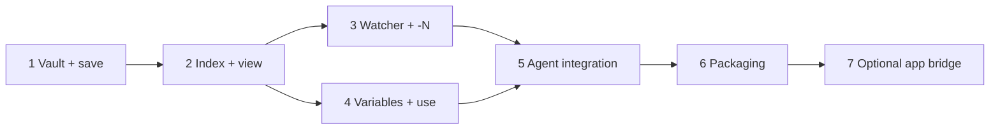

# PromptNest — Phased Implementation Plan (Local File-Based Skill)

> **Status:** design report (no code changed). Describes *how* to build it when you decide to.
> **Prev:** [`01_Architecture_and_Design.md`](01_Architecture_and_Design.md) · **Next:** [`03_Use_Case_Install_and_Use.md`](03_Use_Case_Install_and_Use.md)

---

## How to read this

Seven phases, each shipping something usable. There is **no backend and no auth to build** — it's all local files — so complexity is low. Recommended stack: **Node 18+ / TypeScript**, `commander` (args), `gray-matter` (frontmatter), native `fs`. Published as one npm package run via `npx promptnest`.

---

## Phase 1 — Vault + save the latest prompt (explicit text)

The core loop, before wiring the watcher.

- **Modules:** `config.ts`, `store.ts` (frontmatter read/write), `cli.ts`, `commands/save.ts`
- **Interfaces:** `pn save --text "..." --desc ... --keywords a,b --group g` → writes `prompts/<group>/<file>.md`; auto-creates group folder.
- **Dependencies:** Node/TS, `commander`, `gray-matter`.
- **Difficulty:** Low
- **Risks:** Filename collisions → use `date_slug` ids; sanitize group/file names for cross-platform paths.
- **Acceptance:**
  - `pn save --text "review this" --group code-review` creates a readable `.md` with frontmatter.
  - Group folder is auto-created when missing.

## Phase 2 — Index + local viewing

Make the vault countable, listable, and browsable — this answers "how do I view it?"

- **Modules:** `index.ts` (build `index.json` + `INDEX.md`), `commands/{list,search,get,count,open,rebuild-index}.ts`, `output.ts`
- **Interfaces:** `pn list`, `pn search "<q>"`, `pn get <id>`, `pn count`, `pn open`, `pn rebuild-index`, global `--json`.
- **Dependencies:** Phase 1.
- **Risks:** Index/file drift → `rebuild-index` regenerates from files (files are source of truth).
- **Acceptance:**
  - After saving, `INDEX.md` lists the prompt with a working relative link.
  - `pn list --json` returns structured data; `pn search` finds by title/keyword/body.

## Phase 3 — The watcher (history log) + `-N` recency

Turn "save the latest prompt" into "save the Nth-from-latest."

- **Modules:** `history.ts` (append/read/`-N` resolve), `commands/log.ts`, extend `save.ts` to accept `-N`.
- **Interfaces:** `pn log` (reads stdin JSON, appends to `history.jsonl`); `pn save -N ...`; `pn count` reports history length.
- **Dependencies:** Phases 1–2.
- **Difficulty:** Low–Med
- **Risks:** Unbounded history size → cap to last N lines; stdin JSON shape differs per agent → parse defensively (`prompt` field or raw text).
- **Acceptance:**
  - Piping a prompt to `pn log` appends a timestamped line.
  - `pn save -2` promotes the second-to-last logged prompt; out-of-range gives a clear error with the count.

## Phase 4 — Variables + `use`

Make saved prompts reusable functions.

- **Modules:** `render.ts`, `commands/use.ts`
- **Interfaces:** `pn use <id> --var k=v ...`; bumps `uses`; reports `missing_variables`.
- **Dependencies:** Phases 1–2.
- **Difficulty:** Low
- **Acceptance:**
  - `pn use <id> --var language=python` returns filled text; missing vars are listed, not dropped.
  - `uses` count increments in the file + index.

## Phase 5 — Agent integration (slash commands, hook, skill)

Wire it into the agents.

- **Artifacts:**
  - Slash commands: `/promptsave` (`pn save -1`), `/savepromt -N` (`pn save -N`), `/promptnest` (`pn list`/`search`) as `.claude/commands/*.md`.
  - `UserPromptSubmit` hook snippet for `settings.json` (calls `pn log`).
  - Optional `SKILL.md` so the agent understands the whole workflow.
  - `CLAUDE.md` / `AGENTS.md` / `.cursorrules` guidance for always-on surfacing.
- **Dependencies:** Phases 1–4.
- **Difficulty:** Low
- **Risks:** Only Claude Code has the prompt hook → document Cursor/Codex fallback (`pn save --text`).
- **Acceptance:**
  - Fresh Claude Code project: hook logs prompts; `/savepromt -2` saves the right one; `/promptnest` lists them.

## Phase 6 — Packaging & distribution

Ship it so `npx promptnest` just works.

- **Artifacts:** `package.json` `bin` (`promptnest`, `pn`), build to `dist/`, publish to npm; cross-platform vault path (`os.homedir()`); an `pn init` that installs the hook + slash commands into the current project/agent.
- **Dependencies:** Phases 1–5.
- **Difficulty:** Low
- **Risks:** Windows vs POSIX paths for vault + `pn init` writing agent configs.
- **Acceptance:**
  - `npx promptnest@latest count` works on a clean machine; `pn init` sets up Claude Code in one command.

## Phase 7 — Optional bridge to the PromptVault app

Leave a door open without coupling.

- **Artifacts:** `pn export <id> --to-app` (POST to the app's `/api/v1/prompts` with a local token) and `pn import --from-app` (pull from the app). Off by default. See [`04_Appendix_API_Bridge.md`](04_Appendix_API_Bridge.md).
- **Dependencies:** Phases 1–4; requires the app's local-token addition (documented in the appendix).
- **Difficulty:** Med
- **Risks:** Reintroduces auth/network — keep it strictly opt-in so the core stays 100% local.
- **Acceptance:**
  - With the app running + a local token, `pn export <id> --to-app` creates the prompt in the web UI; the core skill still works with the app off.

---

## Dependency graph

## Effort summary

| Phase | Difficulty | Local-only? | Ship-able alone? |
|---|---|---|---|
| 1 Vault + save | Low | ✅ | ✅ |
| 2 Index + view | Low | ✅ | ✅ |
| 3 Watcher + `-N` | Low–Med | ✅ | ✅ |
| 4 Variables + use | Low | ✅ | ✅ |
| 5 Agent integration | Low | ✅ | ✅ |
| 6 Packaging | Low | ✅ | ✅ |
| 7 App bridge | Med | ❌ (opt-in) | optional |

**Minimum viable slice:** Phases 1–3 = you can already capture `/savepromt -N` prompts into browsable local files. Phases 4–5 add reuse + slash commands; 6 makes it installable; 7 is the optional app link.

---

**Next:** [`03_Use_Case_Install_and_Use.md`](03_Use_Case_Install_and_Use.md).
