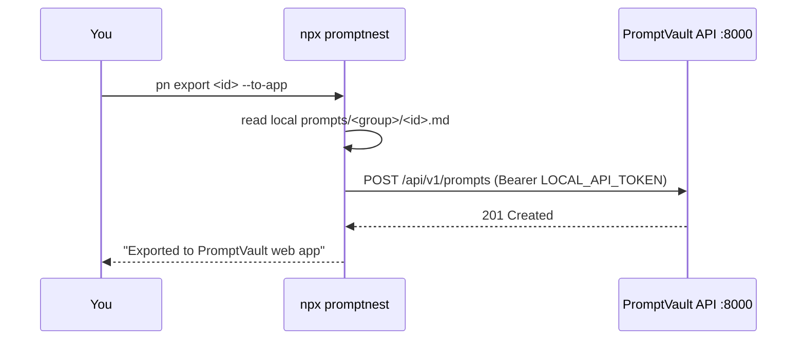

# Appendix — Optional Bridge to the PromptVault Web App

> **Status:** design report (no code changed). **Optional / future** — the core PromptNest skill is 100% local and needs none of this.
> **Index:** [`README.md`](README.md)

---

## 1. Why this appendix exists

The main design ([`00`](00_Agent_CLI_Overview.md)–[`03`](03_Use_Case_Install_and_Use.md)) is a **standalone, local, file-based** skill with **no connection** to the PromptVault web app. That is the product.

This appendix documents an **opt-in door**: if you later want a captured prompt to also live in the PromptVault web app (so you can see it in the browser UI, across devices), a small `export`/`import` bridge makes that possible — **without** coupling the two. The bridge is off by default; disabling or never installing it changes nothing about the local skill.

## 2. What the bridge is

Two commands added to the CLI:

| Command | Direction | Effect |
|---|---|---|
| `pn export <id> --to-app` | local → app | Creates the captured prompt in the web app via `POST /api/v1/prompts` |
| `pn import --from-app [--group g]` | app → local | Pulls prompts from the app (`GET /api/v1/prompts`) into local files |

Both are manual. The core watch/save/list/use loop never calls the network.

## 3. What the app side needs (the earlier API design, reused here)

The PromptVault backend already exposes everything needed (see `backend/app/routers/prompts.py` and `Docs/05_API_Documentation.md`):

- `POST /api/v1/prompts` — create
- `GET /api/v1/prompts?q=` — list/search
- `GET /api/v1/prompts/{id}` — fetch one

The **only** genuinely new backend capability required is a **local API token** so a headless CLI can authenticate (the web app uses a browser-shaped JWT + refresh-cookie flow that a CLI can't easily use):

- Add a token check **beside** the existing `get_current_user` dependency in `backend/app/core/dependencies.py`.
- Source the token from a `LOCAL_API_TOKEN` in `backend/.env` (mapped to one local user), or a "Generate CLI token" button in Settings.
- Pseudocode (documentation only, not implemented):

```python
def get_current_user_or_local_token(request, db):
    token = bearer_token(request)
    if token and token == settings.LOCAL_API_TOKEN:
        return db.get(User, settings.LOCAL_API_USER_ID)
    return get_current_user(request, db)      # existing browser JWT path
```

## 4. Bridge data flow (only when you run it)



## 5. Field mapping (local file ↔ app prompt)

| Local frontmatter | App field |
|---|---|
| `title` | `title` |
| `description` | `description` |
| body (markdown) | `prompt_content` |
| `keywords` | `tag_names` |
| `group` | `group_id` (resolve/create group by name first) |
| `{{variables}}` | `variables` |

## 6. Security notes

- The bridge reintroduces network + auth; keep it **strictly opt-in** so the default product stays fully local.
- The local token is **127.0.0.1-only** and maps to one user's own prompts. Keep it out of shared configs / version control.
- Before exposing the app API beyond your machine, replace the static token with **per-user, revocable, scoped** tokens (out of scope here).

## 7. Recommendation

Build the bridge **last** (Phase 7 in [`02_...`](02_Implementation_Plan.md)), only if you find yourself wanting your captured prompts in the browser UI. Until then, the local skill is complete on its own.

---

**Back to:** [`README.md`](README.md)
